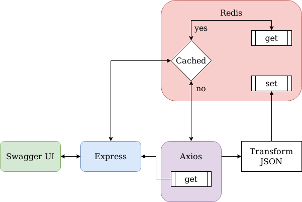
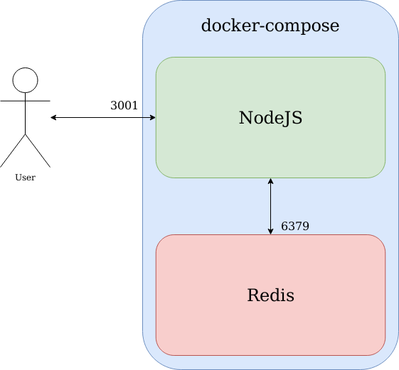

# pd-arch-jopd
## Thought Process
### Programing language
The first challenge of this task was choosing the appropriate programming language and framework. After the first interview, I had three variants on my mind: 
* NodeJS
* Go
* Cobol

Though Cobol would have been a good joke, and I kind of wanted to go with Go, I still decided on NodeJS. After evaluating the task, I found out that the main challenge was transforming one JSON into another. Since JSON stands for JavaScript Object Notation, it was obvious that this task was intended for JavaScript and all other choices were disrespectful towards the abbreviation.

### Backend and Frontend
It was mentioned that I could have used any output type except for stdout. Though this was a bit confusing criteria, I assumed that you didn't want to see the console application. Therefore, I decided to use a browser as an interface for the app. The backend part was clear, but I had to think about the fronted. Since I had to work with an API and my application was also kind of an API, I decided to use Swagger UI.

### Choosing containerisation
My initial plan was to use Kubernetes to look cool, but it appeared that my Amazon free tier server didn't have enough CPUs to create a cluster. Furthermore, it would have been an overkill solution and a waste of time, as I had only 2 containers. Kubernetes was invented to deal with the problem of many containers, and this was not the case for me. Finally, I decided to use Docker along with docker-compose.

### Caching
Since the core task was quite simple and I had a decent amount of time, I decided to implement something that APIs need the most - caching. DuckDuckGo was pretty straightforward and suggested using Redis. Though this seemed like a quick bonus feature, It was the most complicated part since NodeJS tried not to connect at all cost.

### Tests
As an additional feature, I decided to implement unit and integration testing. Though, I have to admit, that it was unwise from my side to do this as the last step. This was a good lesson for me, and I'll always consider it in the future.

## Core
### Application
#### Logic
The application backend is written with somewhat respecting RESTful principles. It has only one endpoint available at `/api/dashboards/:uid`.  

**Logic Diagram:**


Everytime user issues API call the follwing happens:
* **uid** is verified
  * return 400 in case of problems
* Redis cache is checked
  * if cache is found it is returned
  * if not express does the following to dashboard
    * retrieve
    * transform
    * cache
    * return

#### Specifications
Application on default is available on port `3001`

Application uses
* Swagger UI - frontend
* Express - web server
* Axios - web requests
* Redis - caching

As for testing following libraries are used
* Jest - unit and integration testing
* SuperTest - ingeration testing

### Containerization
docker-compose with 2 Docker containers is used.


## Launch instructions
To launch this application you will need following packages:
* docker
* docker-compose
* git

This description is valid for Debian and Ubuntu, if you use other linux distributions you most likley can figure out things by yourself.

**Install required packages**
```bash
sudo apt update
sudo apt install git docker.io docker-compose
```

**Add yourself to docker group to avoid sudo** (optional)
```bash
sudo usermod -a -G docker $USER
logout
```

**Clone this repo** (you can also download it  `¯\_ (ツ)_/¯`)
```bash
git clone https://github.com/arch-xtof/pd-arch-jopd.git
cd pd-arch-jopd
```

**Run in production mode**
```bash
docker-compose -f docker-compose-prod.yml up --build
```

Application will become available at `localhost:3001/swagger/`. Substitute localhost with ip or domain if needed.

## Further Development
If someone randomly becomes interested in further development of this applications, here are additional commads.

**Run in development mode**

Change code realtime
```bash
docker-compose up --build
```

**Run tests**
```bash
docker-compose -f docker-compose-test.yml up --build
```